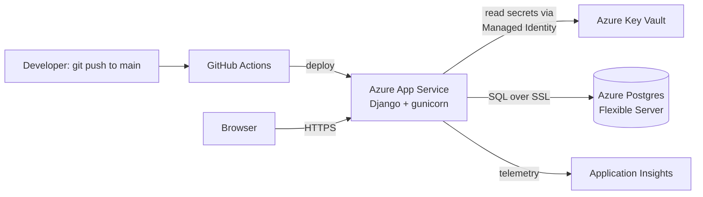

# TaskFlow

A Django task management app deployed end-to-end on Azure

## Tech Stack

**Application**
- Python 3.12, Django
- Bootstrap 5 + django-crispy-forms for UI
- gunicorn (production WSGI server), whitenoise (static file serving)

**Azure services**
- Azure App Service (Linux, B1 plan) — hosts the Django app
- Azure Database for PostgreSQL Flexible Server — application database
- Azure Key Vault — secrets storage (DB credentials, `SECRET_KEY`)
- Managed Identity — passwordless authentication from App Service to Key Vault
- Application Insights — request monitoring and live metrics

**DevOps**
- GitHub Actions — CI/CD pipeline, auto-deploys on push to `main`
- Environment-aware settings (`IS_AZURE` flag) to separate local dev / CI builds from production secrets

## Features

- User registration and login (Django's built-in auth, extended with a custom registration form)
- Full CRUD for tasks — create, list, edit, delete
- Per-user data isolation (each user only sees their own tasks)
- Custom fields: status (Pending / In Progress / Completed) and priority (Low / Medium / High), each shown as color-coded badges
- Title uniqueness enforced per-user (not app-wide) via a model constraint

## Architecture



## Local Setup

```bash
git clone <repo-url>
cd taskflow
python3 -m venv venv
source venv/bin/activate
pip install -r requirements.txt
```

Create a `.env` file in the project root:
```
SECRET_KEY=your-local-secret-key
DB_NAME=taskflowdb
DB_USER=taskadmin
DB_PASSWORD=your-db-password
DB_HOST=your-db-host.postgres.database.azure.com
```

```bash
python manage.py migrate
python manage.py runserver
```

## Deployment

Pushing to `main` triggers `.github/workflows/deploy.yml`, which:
1. Installs dependencies
2. Runs `collectstatic`
3. Deploys the built app to Azure App Service via the `azure/webapps-deploy` action

Secrets (DB credentials, `SECRET_KEY`) are pulled from Azure Key Vault at runtime using the App Service's system-assigned managed identity — nothing sensitive is stored in GitHub or in App Service configuration.
